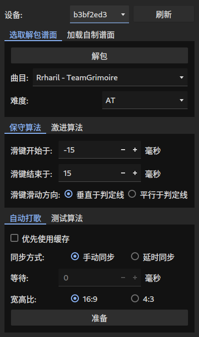
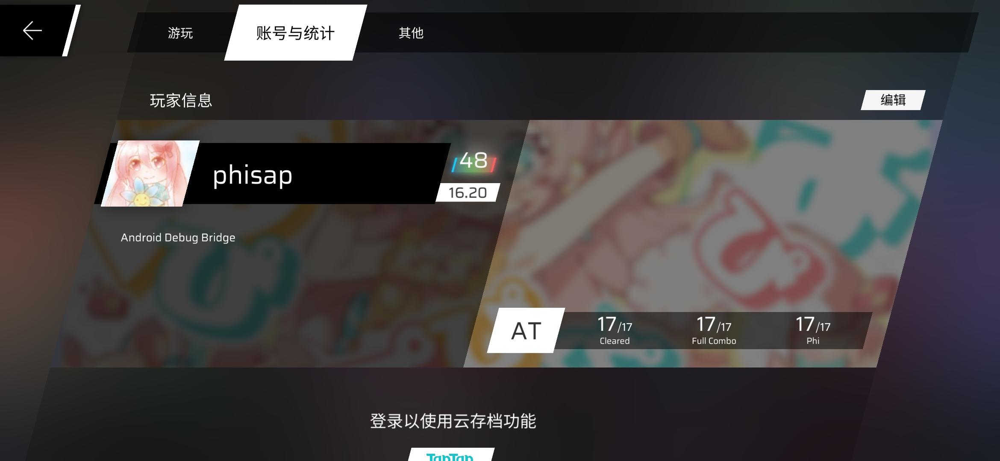
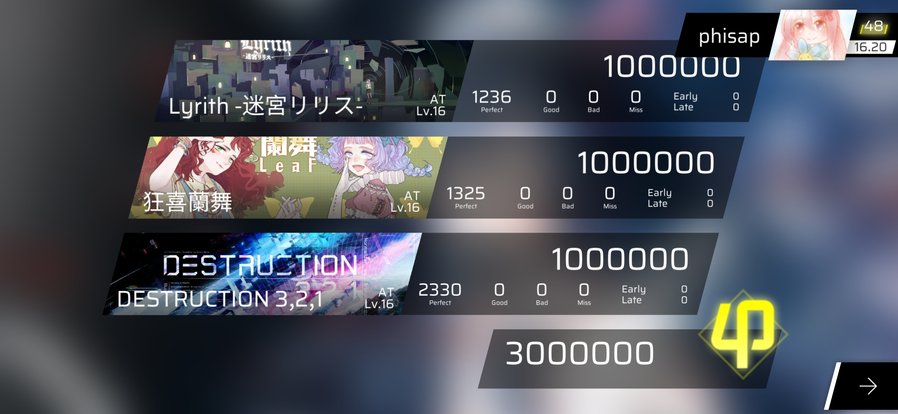

<div align="center">

<p align="center">
    
</p>

# phisap
<ins>PHI</ins>gros(-like) <ins>S</ins>emi-<ins>A</ins>utomatic <ins>P</ins>layer

✨ 适用于(类)Phigros音游的半自动打歌器 ✨

**仅支持安卓设备**


_phisap的图标由[@ShintoKosei](https://github.com/ShintoKosei)制作，授权给phisap项目使用，ShintoKosei保留所有权利_

</div>

---

你现在所在的分支为`dev`，包含最新的更新内容，不过不保证一定可用，因此不推荐普通用户使用

如果想切换回旧版phisap所在分支，[请点击这里返回](https://github.com/kvarenzn/phisap/tree/stable)

本分支的更新仅在以下环境上测试过：PC OS: archlinux x64，游戏设备: OnePlus 7 Pro，氢OS 10.0.10.GM21


## 目录

- [免责声明](#免责声明)
- [灵感来源](#灵感来源)
- [成果展示](#成果展示)
- [如何使用](#如何使用)
  - [准备](#准备)
  - [运行](#运行)
- [工作原理](#工作原理)
- [注意事项](#注意事项)
- [暂不支持的谱面](#暂不支持的谱面)
- [课题模式](#课题模式)
- [遇到问题?](#遇到问题?)
- [对 Arcaea 的支持](#对arcaea的支持)
- [致谢](#致谢)
- [开源许可](#开源许可)
- [更新日志](#更新日志)

## 免责声明

- 本项目属于个人兴趣项目，与厦门鸽游网络有限公司无关
- **本项目内不含任何版权素材，且本项目并非商业项目**
- 项目的服务端借用自[Genymobile/scrcpy](https://github.com/Genymobile/scrcpy)，在此感谢 scrcpy 的作者和维护者们
- 截止目前，项目作者从未在任何除 GitHub 以外的平台上以任何方式宣传过本项目

## 灵感来源

> Tip: sudo 板子自己打歌

## 程序界面



- 注：这张图是在arch linux上截的，Qt的样式设置为Kvantum，依赖GTK的Materia Dark主题
- 注2: 截图的更新可能并不及时，请以实际的运行结果为准

## 成果展示

<details>
<summary>两张手机截图</summary>




</details>

## 如何使用

### 准备

0. **请安装 Python 3.11**
   - 请使用正式版，**不要使用开发者预览(early developer preview)版**
1. 使用`pip install -r requirements.txt`安装依赖
2. 请安装`Android Debug Bridge`，**要求版本号至少为`1.0.41`**，并确保相应的环境变量已经配置好。
3. 请准备 Phigros 的游戏安装包/通用数据包。目前支持的游戏版本为 2.0.0 至 3.1.2
   - 如果你的 phigros 是 taptap 版，那么只需要游戏安装包即可
     - 如果你使用\*nix 系统(如 Linux 或 Mac OS)，则你可以使用如下的`bash shell`命令从安卓设备上提取安装包
       ```bash
       adb pull $(adb shell pm path com.PigeonGames.Phigros | cut -f2 -d:) ./Phigros.apk
       ```
     - 如果你使用 Windows 操作系统，那么你可以在`powershell`中运行下面的命令
       ```powershell
       adb pull (adb shell pm path com.PigeonGames.Phigros).Split(":")[1] ./Phigros.apk
       ```
   - 如果你的 phigros 是 Google Play 版，那么**不要提取安装包，请提取数据包**(后缀为.obb)，因为谱面数据并不在安装包内
     - 这个数据包一般在游戏设备的`/sdcard/Android/obb/com.PigeonGames.Phigros/`目录下
     - 名称类似于`main.82.com.PigeonGames.Phigros.obb`
     - 大小约为 1.3GB
     - 使用`adb pull`或者文件管理器直接复制出来即可
   - 当然，如果你不想手动提取，也可以直接去网上下载一个 phigros 的安装包或数据包，注意版本对应即可
4. 准备服务端。请去[scrcpy 的 releases 页面](https://github.com/Genymobile/scrcpy/releases) 下载`scrcpy-server-v2.0`，不要下载成别的版本。下载完成后，请将文件直接放置在 phisap 的根目录（与`main.py`之类的文件在同一文件夹即可），不要更改文件的名称（比如添加后缀），否则 phisap 将无法识别
   - 如果你使用\*nix 系统，且安装有 wget，那么下面的命令与上面描述的操作等效:
     ```bash
     cd phisap  # 定位到phisap的根目录下
     wget https://github.com/Genymobile/scrcpy/releases/download/v2.0/scrcpy-server-v2.0
     ```

### 运行

```bash
cd phisap # 将CWD(Current Working Directory，当前工作目录)设置为phisap的根目录，以便phisap查找服务端文件
python main.py
```

## 工作原理

- 读取并缓存游戏安装包中的所有谱面文件
- 解析谱面文件，分析出每个音符的击打位置、击打方式和击打时间
- 将这些击打操作转换为触控事件序列
  - 即按下(DOWN)、移动(MOVE)和抬起(UP)
- 开始操作后，逐一向设备发送这些触控事件

## 注意事项

- 虽然 phisap 的灵感来源为`sudo 板子自己打歌 `，不过**本程序并不依赖 root 权限工作**
- 一些情况下有可能因误触发三指截屏或通知中心而导致 miss，不是每台设备都会触发，视厂商和设备型号而定
- **phisap 当前完美支持的最高版本为 3.1.2**，所有的曲目/任意难度均可以 AP，除了一些特殊类型的谱面（不用担心，不会影响 rks）。这些谱面详见[暂不支持的谱面](#暂不支持的谱面)。不过，在使用 phisap 时可能会发现一些谱面无法 AP，那么这时你需要
  - 确保计时器同步的精确程度满足要求，如果你发现 phisap 打出了 FULL COMBO，但并没有 AP，这**一定**说明你的计时器同步没有做好
  - 如果计时器同步没有问题，那么你可以试试换一个规划算法。目前一些谱面只能由保守算法达成 AP，而另一些只能由激进算法达成，当然，大部分的谱面使用任意一个都可以完成
  - 如果你发现还是不行，那么你可以考虑开一个 issue，跟我说明这个问题

PS: 如果你知道怎样实现不 root 的前提下精确获知当前曲目进度，且愿意帮助本项目的话，请开 issue 告知我做法

## 暂不支持的谱面

### 单曲精选集中的《Random》

暂时没有找到什么可以自动化判断当前谱面的办法，如果你有好的想法，请开 issue。或许图像识别是一个可行的方式

不过目前 phisap 可以解包出全部的随机谱面（ID 为`Random.SobremSilentroom.<n>`，`<n>`从 0 到 6），所以理论上，如果你的手速够快，完全可以应对随机谱面

### 愚人节谱

这些玩意太逆天了，不在 phisap 的全 p 目标范围内。phisap 作者并不会针对愚人节谱面进行规划算法的改进

## 课题模式

phisap 并没有对课题模式做特殊的支持，将来也许会有

不过现有的功能完全可以使你拿到彩 48 标签，但是需要一点点技巧

我推荐的配置是

- 迷宫莉莉丝 (AT16)
- 狂喜兰舞 (AT16)
- DESTRUCTION 3,2,1 (AT16)

也就是下面这三个，顺序任意

这三个谱面的特点是开局没有过分的判定线演出，便于手动同步定时器，同时相比于其他 AT16，这三个谱面在课题模式下也算是判定比较宽松的

然后按照如下步骤操作 phisap

1. 使用`保守算法`规划这三个谱面（注意难度选 AT）
   - `规划算法`选择`保守算法`，切换到`测试算法`标签页，勾选`缓存规划结果`，选定`曲目`和`难度`之后点`执行`
   - 对其余两个谱面重复相同的步骤
2. `同步方式`选`手动`，`曲目`选择第一首的，`难度`选`AT`，勾选`优先使用缓存`，然后点`准备`
3. 在游戏设备上设置课题模式并开始
4. 看着游戏设备，在 note 快落到判定线时点击`开始!`按钮
5. 观察 note 被击打时相对判定线的位置，调整`微调`，确保 note 在击打时跟判定线重合
   - 如果你开局就蓝线了那也就甭微调了，直接重开罢
6. 在 phisap 自动游玩当前谱面时，调整`曲目`为下一首的曲目
7. 在 phisap 的按钮重新变回`准备`（或看到控制台输出“操作结束”）后，点击`准备`按钮。此时你的游戏设备应该还在加载下一首曲目
8. 为剩下两首曲目重复步骤 4 到 7
9. 如果运气好的话，你应该能得到一个彩 48

## 遇到问题?

**请开 issue，并在 issue 中包含如下内容**

- 你的操作系统版本
- 你遇到的问题
- 能反映遇到的问题的日志、记录或者截图

**如果之后的更新解决了你的问题，请关闭自己开的 issue**

**如果一百度就能找到解决方法的问题，不要开 issue，例如依赖安装问题，如果你开了也会被我关上甚至删除**

## <del>对 Arcaea 的支持</del>

**2023/07/26更新：目前对arcaea的支持仅限于2021年及以前的版本，对最新版的支持将在后续更新中陆续实现**

项目`闊靛緥婧愮偣/`文件夹下的文件实现了最简陋的对音游韵律源点（arcaea）的支持，原理完全相同。

需要您手动提取谱面文件（比 phigros 简单，网上搜索一下就能找到），再运行`闊靛緥婧愮偣/main.py`，按照程序提示输入。

支持的谱面声明包括：

- 函数：`arc()`、`arctap()`、`timing()`和`hold()`，`scenecontrol()`会被忽略
- easing：`b`、`s`、`si`、`so`、`sisi`、`soso`、`siso`和`sosi`
- 其余**均不支持**，尤其是对 camera 的操作

## 对社区自制谱/类 Phigros 社区音游的支持

目前支持的谱面格式

- 官谱格式
  - 后缀为`.json`
  - 对象的键和值的类型与官谱一致
- PEC 格式
  - 后缀为`.pec`或`.json`(极少数情况)
  - 纯文本文件，以行为单位
- RPE 格式
  - 后缀为`.json`

支持情况

- 官谱
  - 完全支持
- PEC 格式
  - 支持所有指令
  - 暂不能很好处理事件之间相互重叠的情况
    - 例如：
      - 事件一：起始于时间 A，终止于时间 C
      - 事件二：起始于时间 B，终止于时间 D
      - A < B < C < D
- RPE 格式
  - 忽略 ID 为 30 以上的 easingType
  - 忽略`posControl`、`skewControl`、`yControl`以及所有的`extendedEvents`(`inclineEvents`、`scaleXEvents`和`scaleYEvents`)，但可以正确解析它们

请注意：对 pec 和 rpe 的支持目前正在开发中，处于初期阶段，实际体验可能并不理想。如果你发现了 phisap 不支持的谱面，可以开一个 issue，并附上必要信息

## 致谢

- `control.py`中的大部分代码参考自[Genymobile/scrcpy](https://github.com/Genymobile/scrcpy)
- `catalog.py`和`extract.py`中的代码参考自[Perfare/AssetStudio](https://github.com/Perfare/AssetStudio)

感谢上述优秀的项目和创造或维护它们的个人或企业。

- 感谢@ShintoKosei为phisap设计并制作了图标、美化了README的排版

## 开源许可

除图标(`public/img/phisap_s.png`和`public/img/Phisap.png`)外，phisap的其他内容以WTFPL协议开源

图标仅限phisap项目本身使用，其他任何人或团体不得以任何方式使用，原作者 @ShintoKosei 保留所有权利

## 更新日志
### (2023/08/12) v0.18
- 初步实现OTG/HID协议及相关功能，现在phisap可以模拟一个触控屏直接向游戏设备发送控制指令
  - 实现该协议有如下好处
    - 无需游戏设备启用USB调试功能，可以一定程度上避免某些游戏的作弊检测
    - 如果开启"显示点按操作反馈"，通过HID协议发送的指令也可以显示出来触点，录屏效果更真实
    - 或许可以一定程度上提升触控事件发送效率（？待确认）
  - 目前该实现正处于初级阶段，还有很多问题，正在逐步改进
    - 目前**禁止普通用户**使用该功能
    - 如果你也是开发者，那随意
  - 我在实现该功能时，顺便在`hid.md`中记录了开发历程，如果你也在开发OTG/HID相关功能，希望它可以帮助到你

### (2023/08/08) v0.17
- Pgr 3.1.2
  - tmd这谱子不会是谱师溜大了写出来的吧
- 加入倍速支持
  - 倍速选择范围跟phira相同：0.5至2.0，间隔0.05

### (2023/08/06) v0.16
- 修复pgr旧谱(formatVersion=1)解析错误的问题
- 更正缩放逻辑
  - 假设谱面的尺寸为880x520，谱面中有一根判定线，中心点在(a, b)，在某时刻t，判定线的偏转角度为d，此时该判定线上的某个音符N落到线上，N的x轴偏移(positionX)为x。现在这个谱面显示在16:9的屏幕上(设屏幕长为16r，宽为9r)，phisap需要计算N的位置以便击打这个音符
    - 在之前的版本，phisap会先计算位置，再针对屏幕进行缩放，也就是
      1. 计算t时刻N的位置为(a, b) + (cos(d) * x, sin(d) * x) == (a + cos(d) * x, b + sin(d) * x)
      2. 缩放上一步计算得到的坐标，即最终的坐标为((a + cos(d) * x ) / 880 * 16r, (b + sin(d) * x) / 520 * 9r)
    - 此次更新后，phisap会先缩放坐标，再计算位置，即
      1. 缩放判定线所在位置，即(a / 880 * 16r, b / 520 * 9r)
      2. 缩放x轴偏移(x / 880 * 16r)
      3. 计算最终坐标，得(a / 880 * 16r, b / 520 * 9r) + (cos(d) * (x / 880 * 16r), sin(d) * (x / 880 * 16r)) == ((a + cos(d) * x ) / 880 * 16r, b / 520 * 9r + sin(d) * (x / 880 * 16r))
    - 后者是phigros和大部分模拟器的逻辑。此次改动应该能修复部分G/B/M的问题

### (2023/08/06) v0.15
- 加入极端算法，主要用于应对各种创人配置（当然应对一般谱面也没什么问题（大概））
  - 极端算法固定采样率为125Hz，应该能修复某些设备的卡顿发热问题
  - 目前极端算法并没有设置项
  - 极端算法目前正在开发中，可能在实际的使用中会遇到一些问题
- 为激进算法加入新设置项：规划出现问题时强制继续
  - 感谢[@364hao](https://github.com/364hao)提供的思路，详见[issue#107](https://github.com/kvarenzn/phisap/issues/107)
  - 虽然不知道为什么能work，but it just works (sometimes)
- 其他的小修小补
- 本次更新需要安装新依赖`shapely`，用于计算note的判定区
  - `pip install -r requirements.txt --upgrade`

### (2023/08/02)
- 拆分`main`分支为`stable`和`dev`

### (2023/07/26) v0.14
- 上次更新后许多(>2)人开issue称激进算法报废了，现作出如下改动
  - 激进算法恢复采样率为1000Hz
  - 保守算法添加设置项用于设置采样间隔
    - 一般将采样间隔设置为近似`ceil(1000 / 你的屏幕的报点率(或触控采样率))`
      - `ceil`为向上取整
    - 例如：假设你屏幕的触控采样率为360Hz，则推荐设置采样间隔为`ceil(1000 / 360) = ceil(2.7777...) = 3`ms
    - 视设备而定，一部分设备甚至可以将采样间隔设置为`1`ms（无论屏幕触控采样率为多少）

- 计划下次更新实现设置目标分数的功能，也就是可以让phisap不再AP而是得到一个指定的分数
- 本次更新需要安装新的依赖`z3-solver`，用于求解线性规划问题
  - `pip install -r requirements.txt --upgrade`


### (2023/07/18) v0.13
- 减少flick和hold的采样率，由原来的1000Hz（每隔1ms生成/发送一个事件）降低到125Hz（每隔8ms生成/发送一个事件）
  - 模拟125报点率的触摸屏，避免部分机型上事件丢失的问题
  - 减少传输带宽的占用和磁盘的占用（缓存的大小减少了80%）
  - 一定程度上可以减少flick漏判的机率
  - 由于采样率变成了125Hz，推荐将红键触发方式按照如下配置
    - `滑键开始于`: `-17`
    - `滑键结束于`: `17`
    - `滑动方向`: `垂直于判定线`
      - 如果你发现有时候自动打歌把你的通知栏拉下来导致了miss，那么你可以选择`平行于判定线`来一定程度上避免这个问题

### (2023/07/18) v0.12
- 允许通过图形界面直接配置红键的触发方式
  - `滑键开始于`和`滑键结束于`用于设置触发红键的滑动操作的起始和终止时间（相对于红键落到判定线的时间）。例如，前者配置为-15，后者配置为15表示红键落到判定线前15毫秒开始滑，滑动30毫秒后抬起
  - `滑动方向`，顾名思义是配置触发红键要往哪个方向滑，目前只可以设定为垂直于红键或平行于红键

### (2023/07/18) v0.11
- 使用二进制格式存储规划结果，节省磁盘空间&加快加载速度
  - 注意，这版更新需要手动清除以前生成的缓存（删掉`.cache.d`文件夹）
- 修复计算时间序列的一个潜在恶性bug


### (2023/07/16) v0.10
- 修复保守算法规划的结果不能用的问题
- 调整滑键的距离由`屏幕的长度 / 10`到`屏幕的宽度 / 10`

### (2023/07/15) v0.9

- 修复部分设备上的红键漏判问题 (见 issue #82)
- 修复部分谱面原来可以用保守算法规划，现在却不行的问题

### (2023/07/09) v0.8

- 现在解包不会再解包出一个名为`#ChapterCover`的空文件夹
- 读取自制谱面时强制使用`UTF-8`编码
  - fix issue#80

### (2023/07/08) v0.7

- 自动加载/保存设置
  - 配置文件由原来的`cache`更改为`.settings.ini`
- 微调布局
- Pgr 3.1.1.1

### (2023/07/08) v0.6

- 替换 GUI 库为 PyQt5
  - 为什么不是 PySide？因为我的开发机的系统里装了 PyQt5 但没装 PySide
  - **注意：需要安装新依赖`pip install -r requirements.txt --upgrade`**
- 加入英文界面
- 保持开源许可为`WTFPL`
- 加入对宽高比 4:3 的设备的支持
- 修复解析 pec 和 rpe 谱面时遇到的一些问题

### (2023/07/03) v0.5

- 初步支持 rpe 格式
  - 加载自制谱时选择“JSON 格式”即可，phisap 会自动判断是 pgr 格式还是 rpe 格式
  - 一些曲目可能仍会 miss 一到两个 note(多数为 flick)
  - 对于 rpe 格式，规划时默认屏幕尺寸为 1350x900
  - 目前暂时不支持的内容（并不会报错，只是 phisap 会忽略它们）
    - `easingType`大于等于 30 的值
      - 根据 phira 的源码，它会忽略这些`easingType`，并把它们当作`f(t) = 0`，目前 phisap 的行为跟 phira 一致
    - `scaleXEvents`, `scaleYEvents`, `inclineEvents`等事件
    - `posControl`, `sizeControl`, `skewControl`, `yControl`等控制事件
    - 一些跟打歌不相关的内容 phisap 会主动忽略（如判定线透明度控制）
- 修复 pec 谱面规划的一些问题

  - 去掉时间线处理相关的代码的`assert`，因为一些谱面的事件并不按规范来
  - 暂时还没有解决事件之间相互覆盖的问题，所以可能会导致一些意想不到的 miss
  - 尚未确定时间标签相近的事件的处理办法，目前是后者会覆盖前者
    - 尚未确定“相近”的定义，一些谱面可能差几毫秒算“相近”，另一些则必须精确到`1e-12`

- 现在 phisap 将不再只通过文件后缀名判断谱面格式
  - 因为一些 pec 格式的谱面的后缀名也是 json，虽然里面的内容跟 json 八竿子打不着
  - 如果文件的后缀名是 pec，则假定该文件为 pec 格式的谱面

### (2023/07/02) v0.4

#### 算法

- 为了支持其他格式的谱面，现在不再假设屏幕尺寸为一个固定的值，默认 pec 格式为 2048x1400，phigros 格式为 16x9(旧谱(`formatVersion = 1`)为 880x520)
- 初步支持 pec 格式和 phigros 格式(json)的自制谱的加载

#### 界面

- 为了支持自制谱的加载，对 UI 进行了较大幅度的改动
  - 但并没有微调布局，所以强迫症应该受不了

### (2023/07/01) v0.3

#### 算法

- 音符 x 轴偏移量(`position_x`)乘的系数由原来的`72`变更为`1`
- 规划算法默认的屏幕尺寸由 1280x720 变更为 16x9
- 所有的二维向量/坐标运算现由 python 内建的复数运算驱动
  - 规划算法的运行效率将会有明显的提升
- 以上更改是为了适配其他谱面格式(如 PEC)做准备
- 尚未完全确认这些变更带来的后果，如果有因为这次改动导致的无法 AP，请开 issue
- 规划算法的缓存方式更新，现在所有的执行结果将保存到 phisap 根目录的`.cache.d`文件内
  - 先前的缓存全部失效

#### 界面

- 现在，GUI 窗口的标题栏中会显示 phisap 的版本

### (2023/06/29) v0.2

- 重新依赖 lz4.block 用作解压缩 lzma 数据
  - 由于在 Windows 上，安装 lz4 需要依赖 MSVC，因此可能一部分人会安装失败，此时 phisap 将启用纯 python 的解压函数实现

### (2023/06/28) v0.1

- 为 phisap 加入版本号，并设定初始版本号为 0.1
- 在 README 中加入更新日志
- 修复此前遇到的一些问题
