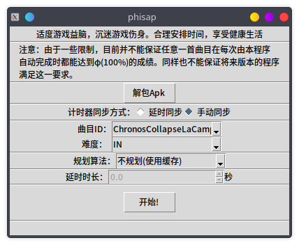

# phisap - PHIgros Semi-Auto Player
适用于音游Phigros的半自动打歌器，**仅支持安卓/鸿蒙设备**。

## 免责声明
+ 本项目属于个人兴趣项目，与厦门鸽游网络公司无关。
+ 项目的服务端借用自[Genymobile/scrcpy](https://github.com/Genymobile/scrcpy)。
+ **您因使用或修改本程序所造成的一切后果由您自己承担。**
+ 截止目前，项目作者从未在任何除github以外的平台上以任何方式宣传过本项目，**但并不代表以后不会。**
+ **请不要在各大视频网站以任何正面或负面的方式宣传本项目。**
+ **项目作者(kvarenzn)保留本项目所有权及对项目内所有内容的最终解释权。**

## 灵感来源
> tips: sudo 板子自己打歌

## 成果展示（雾）


## 如何使用

### 准备
0. **请安装Python 3.10。**
1. `pip install -r requirements.txt`。
2. 请安装`Android Debug Bridge`，**要求版本号至少高于`1.0.41`**，并确保相应的环境变量已经配置好。
3. 请准备Phigros的游戏安装包。目前支持v1.6.9至v2.1.1。
4. 准备服务端。请去[scrcpy的releases页面](https://github.com/Genymobile/scrcpy/releases) 下载`scrcpy-server-v1.21`，下载后请**直接**放到本项目的根文件夹下(文件的全名就叫`scrcpy-server-v1.21`，一定不要改成别的名称！！)。

### 运行
```bash
python main.py
```

### 运行截图

(好丑，下次更新用PySide2重写一下界面罢)

## 注意事项
+ 本程序**不依赖**root权限工作。
+ 本程序的工作原理为向游戏设备发送触控事件来模拟人类游玩时的点击、长按或滑动，所以一些情况下仍有可能因误触发三指截屏或通知中心而导致miss。
+ 如您所见，本程序可以AP目前所有的曲目，但并不能保证每次都可以AP。

## 对Arcaea的支持
项目`闊靛緥婧愮偣/`文件夹下的文件实现了最简陋的对音游韵律源点（arcaea）的支持，原理完全相同。

需要您手动提取谱面文件（比phigros简单，网上搜索一下就能找到），再运行`闊靛緥婧愮偣/main.py`，按照程序提示输入。

支持的谱面声明包括：
+ 函数：`arc()`、`arctap()`、`timing()`和`hold()`，`scenecontrol()`会被忽略
+ easing：`b`、`s`、`si`、`so`、`sisi`、`soso`、`siso`和`sosi`
+ 其余**均不支持**，尤其是对camera的操作

暂时不打算对arcaea进行更深入的支持，加入这些内容的原因是不想让这些以前写过的东西浪费掉，或许能作抛砖引玉之用。

## 致谢
+ `control.py`中的大部分代码参考自[Genymobile/scrcpy](https://github.com/Genymobile/scrcpy) 。
+ `catalog.py`和`extract.py`中的代码参考自[Perfare/AssetStudio](https://github.com/Perfare/AssetStudio) 。

感谢上述优秀的项目和创造或维护它们的个人或企业。

## 开源许可
除部分有参考来源的代码按其作者要求的方式开源外，**其余代码按照`WTFPL`许可开源。**
