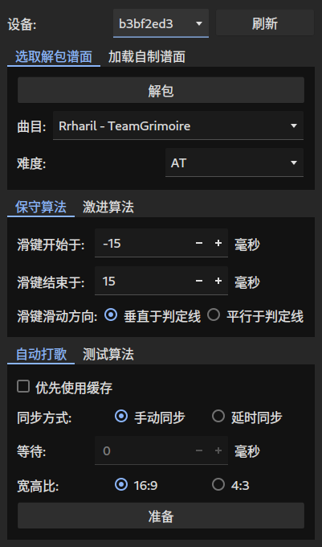
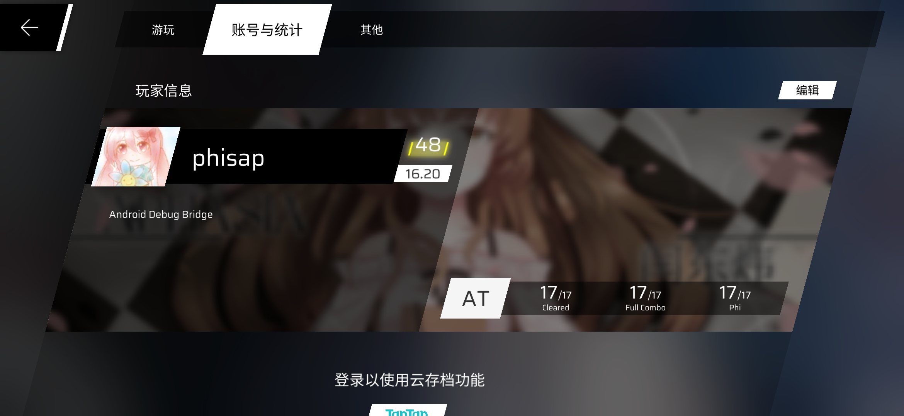
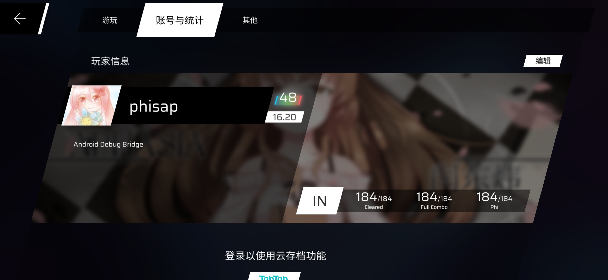
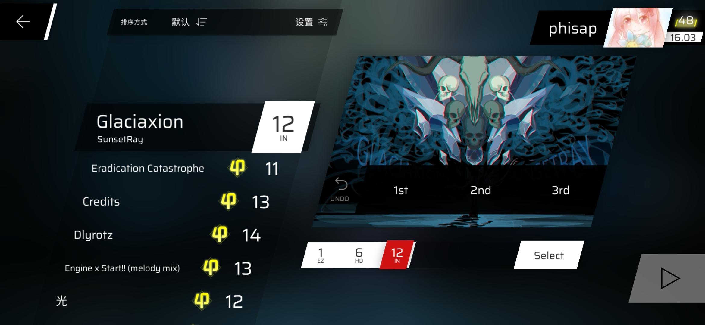

<div align="center">
<h1 align="center">phisap</h1>

PHIgros Semi-Automatic Player

适用于音游 Phigros 的半自动打歌器，仅支持安卓设备


</div>

## 目录

- [免责声明](#免责声明)
- [灵感来源](#灵感来源)
- [成果展示](#成果展示)
- [如何使用](#如何使用)
  - [准备](#准备)
  - [运行](#运行)
- [工作原理](#工作原理)
- [注意事项](#注意事项)
- [暂不支持的谱面](#暂不支持的谱面)
- [课题模式](#课题模式)
- [遇到问题?](#遇到问题?)
- [对 Arcaea 的支持](#对arcaea的支持)
- [致谢](#致谢)
- [开源许可](#开源许可)
- [更新日志](#更新日志)

## 免责声明

- 本项目属于个人兴趣项目，与厦门鸽游网络有限公司无关
- **本项目内不含任何版权素材，且本项目并非商业项目**
- 项目的服务端借用自[Genymobile/scrcpy](https://github.com/Genymobile/scrcpy)，在此感谢 scrcpy 的作者和维护者们
- 截止目前，项目作者从未在任何除 GitHub 以外的平台上以任何方式宣传过本项目

## 灵感来源

> Tip: sudo 板子自己打歌

## 程序界面



## 成果展示

<details>
<summary>两张手机截图</summary>





</details>

## 如何使用

### 准备

0. **请安装 Python 3.11**
   - 请使用正式版，**不要使用开发者预览(early developer preview)版**
1. 使用`pip install -r requirements.txt`安装依赖
2. 请安装`Android Debug Bridge`，**要求版本号至少为`1.0.41`**，并确保相应的环境变量已经配置好。
3. 请准备 Phigros 的游戏安装包/通用数据包。目前支持的游戏版本为 2.0.0 至 3.1.1.1
   - 如果你的 phigros 是 taptap 版，那么只需要游戏安装包即可
     - 如果你使用\*nix 系统(如 Linux 或 Mac OS)，则你可以使用如下的`bash shell`命令从安卓设备上提取安装包
       ```bash
       adb pull $(adb shell pm path com.PigeonGames.Phigros | cut -f2 -d:) ./Phigros.apk
       ```
     - 如果你使用 Windows 操作系统，那么你可以在`powershell`中运行下面的命令
       ```powershell
       adb pull (adb shell pm path com.PigeonGames.Phigros).Split(":")[1] ./Phigros.apk
       ```
   - 如果你的 phigros 是 Google Play 版，那么**不要提取安装包，请提取数据包**(后缀为.obb)，因为谱面数据并不在安装包内
     - 这个数据包一般在游戏设备的`/sdcard/Android/obb/com.PigeonGames.Phigros/`目录下
     - 名称类似于`main.82.com.PigeonGames.Phigros.obb`
     - 大小约为 1.3GB
     - 使用`adb pull`或者文件管理器直接复制出来即可
   - 当然，如果你不想手动提取，也可以直接去网上下载一个 phigros 的安装包或数据包，注意版本对应即可
4. 准备服务端。请去[scrcpy 的 releases 页面](https://github.com/Genymobile/scrcpy/releases) 下载`scrcpy-server-v2.0`，不要下载成别的版本。下载完成后，请将文件直接放置在 phisap 的根目录（与`main.py`之类的文件在同一文件夹即可），不要更改文件的名称（比如添加后缀），否则 phisap 将无法识别
   - 如果你使用\*nix 系统，且安装有 wget，那么下面的命令与上面描述的操作等效:
     ```bash
     cd phisap  # 定位到phisap的根目录下
     wget https://github.com/Genymobile/scrcpy/releases/download/v2.0/scrcpy-server-v2.0
     ```

### 运行

```bash
cd phisap # 将CWD(Current Working Directory，当前工作目录)设置为phisap的根目录，以便phisap查找服务端文件
python main.py
```

## 工作原理

- 读取并缓存游戏安装包中的所有谱面文件
- 解析谱面文件，分析出每个音符的击打位置、击打方式和击打时间
- 将这些击打操作转换为触控事件序列
  - 即按下(DOWN)、移动(MOVE)和抬起(UP)
- 开始操作后，逐一向设备发送这些触控事件

## 注意事项

- 虽然 phisap 的灵感来源为`sudo 板子自己打歌 `，不过**本程序并不依赖 root 权限工作**
- 一些情况下有可能因误触发三指截屏或通知中心而导致 miss，不是每台设备都会触发，视厂商和设备型号而定
- **phisap 当前完美支持的最高版本为 3.1.1.1**，所有的曲目/任意难度均可以 AP，除了一些特殊类型的谱面（不用担心，不会影响 rks）。这些谱面详见[暂不支持的谱面](#暂不支持的谱面)。不过，在使用 phisap 时可能会发现一些谱面无法 AP，那么这时你需要
  - 确保计时器同步的精确程度满足要求，如果你发现 phisap 打出了 FULL COMBO，但并没有 AP，这**一定**说明你的计时器同步没有做好
  - 如果计时器同步没有问题，那么你可以试试换一个规划算法。目前一些谱面只能由 algo1 达成 AP，而另一些只能由 algo2 达成，当然，大部分的谱面使用 algo1 和 algo2 都可以完成
  - 如果你发现还是不行，那么你可以考虑开一个 issue，跟我说明这个问题

PS: 如果你知道怎样实现不 root 的前提下精确获知当前曲目进度，且愿意帮助本项目的话，请开 issue 告知我做法

## 暂不支持的谱面

### 单曲精选集中的《Random》

暂时没有找到什么可以自动化判断当前谱面的办法，如果你有好的想法，请开 issue。或许图像识别是一个可行的方式

不过目前 phisap 可以解包出全部的随机谱面（ID 为`Random.SobremSilentroom.<n>`，`<n>`从 0 到 6），所以理论上，如果你的手速够快，完全可以应对随机谱面

### 愚人节谱

这些玩意太逆天了，不在 phisap 的全 p 目标范围内。phisap 作者并不会针对愚人节谱面进行规划算法的改进

## 课题模式

phisap 并没有对课题模式做特殊的支持，将来也许会有

不过现有的功能完全可以使你拿到彩 48 标签，但是需要一点点技巧

我推荐的配置是

- 迷宫莉莉丝 (AT16)
- 狂喜兰舞 (AT16)
- DESTRUCTION 3,2,1 (AT16)

也就是下面这三个，顺序任意

这三个谱面的特点是开局没有过分的判定线演出，便于手动同步定时器，同时相比于其他 AT16，这三个谱面在课题模式下也算是判定比较宽松的

然后按照如下步骤操作 phisap

1. 使用 algo1 规划这三个谱面（注意难度选 AT）
   - 计时器同步方式选手动同步，选定曲目 ID 和难度之后点开始，按钮变成“开始操作”后关掉 phisap，再打开，重复这一步骤
     - 这个操作逻辑确实有点蠢，不过新 UI 正在设计了（
2. 同步方式选手动，曲目 ID 选择第一首的，难度选 AT，规划算法选不规划，然后点开始
3. 在游戏设备上设置课题模式并开始
4. 看着游戏设备，在 note 快落到判定线时点击“开始操作”按钮或者按下空格键
5. 观察 note 被击打时相对判定线的位置，调整“微调”，确保 note 在击打时跟判定线重合
   - 如果你开局就蓝线了那也就甭微调了，直接重开罢
6. 在 phisap 自动游玩当前谱面时，调整曲目 ID 为下一首的曲目 ID
7. 在 phisap 的按钮重新变回“开始”/看到控制台输出“操作结束”后，点击“开始”按钮。此时你的游戏设备应该还在加载下一首曲目
8. 为剩下两首曲目重复步骤 4 到 7
9. 如果运气好的话，你应该能得到一个彩 48

## 遇到问题?

**请开 issue，并在 issue 中包含如下内容**

- 你的操作系统版本
- 你遇到的问题
- 能反映遇到的问题的日志、记录或者截图

**如果之后的更新解决了你的问题，请关闭自己开的 issue**

**如果一百度就能找到解决方法的问题，不要开 issue，例如依赖安装问题，如果你开了也会被我关上甚至删除**

## 对 Arcaea 的支持

项目`闊靛緥婧愮偣/`文件夹下的文件实现了最简陋的对音游韵律源点（arcaea）的支持，原理完全相同。

需要您手动提取谱面文件（比 phigros 简单，网上搜索一下就能找到），再运行`闊靛緥婧愮偣/main.py`，按照程序提示输入。

支持的谱面声明包括：

- 函数：`arc()`、`arctap()`、`timing()`和`hold()`，`scenecontrol()`会被忽略
- easing：`b`、`s`、`si`、`so`、`sisi`、`soso`、`siso`和`sosi`
- 其余**均不支持**，尤其是对 camera 的操作

## 对社区自制谱/类 Phigros 社区音游的支持

目前支持的谱面格式除了 phigros 的官谱格式(json)外，也部分支持 pec 格式和 rpe 格式的社区自制谱

只需要切换到“加载客制谱面”标签页，点击“选择”按钮，然后选择谱面文件即可

类 Phigros 音游目前经过测试的只有 phira，其他的支持情况尚不明确

请注意：对 pec 和 rpe 的支持目前正在开发，处于初期阶段，实际体验可能并不理想。如果你发现了 phisap 不支持的谱面，可以开一个 issue，并附上必要信息

## 致谢

- `control.py`中的大部分代码参考自[Genymobile/scrcpy](https://github.com/Genymobile/scrcpy)
- `catalog.py`和`extract.py`中的代码参考自[Perfare/AssetStudio](https://github.com/Perfare/AssetStudio)

感谢上述优秀的项目和创造或维护它们的个人或企业。

## 开源许可

除部分有参考来源的代码按其作者要求的方式开源外，**其余代码按照`WTFPL`许可开源。**

<del>预告：将来可能会有一个大更新，其特征为更换现有的 UI 库 tkinter 为其他库，届时将变更开源许可为 GPLv3。如果你有 GPL 协议洁癖，请做好心理准备</del>

不动了，GPLv3 协议太麻烦，还是 WTFPL 好

## 更新日志

### (2023/07/08) v0.8

- Pgr 3.1.1.1

### (2023/07/08) v0.7

- 自动加载/保存设置
  - 配置文件由原来的`cache`更改为`.settings.ini`
- 微调布局

### (2023/07/08) v0.6

- 替换 GUI 库为 PyQt5
  - 为什么不是 PySide？因为我的开发机的系统里装了 PyQt5 但没装 PySide
  - **注意：需要安装新依赖`pip install -r requirements.txt --upgrade`**
- 加入英文界面
- 保持开源许可为`WTFPL`
- 加入对宽高比 4:3 的设备的支持
- 修复解析 pec 和 rpe 谱面时遇到的一些问题

### (2023/07/03) v0.5

- 初步支持 rpe 格式
  - 加载自制谱时选择“JSON 格式”即可，phisap 会自动判断是 pgr 格式还是 rpe 格式
  - 一些曲目可能仍会 miss 一到两个 note(多数为 flick)
  - 对于 rpe 格式，规划时默认屏幕尺寸为 1350x900
  - 目前暂时不支持的内容（并不会报错，只是 phisap 会忽略它们）
    - `easingType`大于等于 30 的值
      - 根据 phira 的源码，它会忽略这些`easingType`，并把它们当作`f(t) = 0`，目前 phisap 的行为跟 phira 一致
    - `scaleXEvents`, `scaleYEvents`, `inclineEvents`等事件
    - `posControl`, `sizeControl`, `skewControl`, `yControl`等控制事件
    - 一些跟打歌不相关的内容 phisap 会主动忽略（如判定线透明度控制）
- 修复 pec 谱面规划的一些问题

  - 去掉时间线处理相关的代码的`assert`，因为一些谱面的事件并不按规范来
  - 暂时还没有解决事件之间相互覆盖的问题，所以可能会导致一些意想不到的 miss
  - 尚未确定时间标签相近的事件的处理办法，目前是后者会覆盖前者
    - 尚未确定“相近”的定义，一些谱面可能差几毫秒算“相近”，另一些则必须精确到`1e-12`

- 现在 phisap 将不再只通过文件后缀名判断谱面格式
  - 因为一些 pec 格式的谱面的后缀名也是 json，虽然里面的内容跟 json 八竿子打不着
  - 如果文件的后缀名是 pec，则假定该文件为 pec 格式的谱面

### (2023/07/02) v0.4

#### 算法

- 为了支持其他格式的谱面，现在不再假设屏幕尺寸为一个固定的值，默认 pec 格式为 2048x1400，phigros 格式为 16x9(旧谱(`formatVersion = 1`)为 880x520)
- 初步支持 pec 格式和 phigros 格式(json)的自制谱的加载

#### 界面

- 为了支持自制谱的加载，对 UI 进行了较大幅度的改动
  - 但并没有微调布局，所以强迫症应该受不了

### (2023/07/01) v0.3

#### 算法

- 音符 x 轴偏移量(`position_x`)乘的系数由原来的`72`变更为`1`
- 规划算法默认的屏幕尺寸由 1280x720 变更为 16x9
- 所有的二维向量/坐标运算现由 python 内建的复数运算驱动
  - 规划算法的运行效率将会有明显的提升
- 以上更改是为了适配其他谱面格式(如 PEC)做准备
- 尚未完全确认这些变更带来的后果，如果有因为这次改动导致的无法 AP，请开 issue
- 规划算法的缓存方式更新，现在所有的执行结果将保存到 phisap 根目录的`.cache.d`文件内
  - 先前的缓存全部失效

#### 界面

- 现在，GUI 窗口的标题栏中会显示 phisap 的版本

### (2023/06/29) v0.2

- 重新依赖 lz4.block 用作解压缩 lzma 数据
  - 由于在 Windows 上，安装 lz4 需要依赖 MSVC，因此可能一部分人会安装失败，此时 phisap 将启用纯 python 的解压函数实现

### (2023/06/28) v0.1

- 为 phisap 加入版本号，并设定初始版本号为 0.1
- 在 README 中加入更新日志
- 修复此前遇到的一些问题
